# 🔄 Traductores y Lenguajes de Programación

## De la Idea al Programa Ejecutable

---

## 🎯 ¿Qué vamos a descubrir hoy?

- 🔧 **¿Cómo se traduce nuestro código para que la máquina lo entienda?**
- ⚡ **¿Por qué algunos programas son más rápidos que otros?**
- 🌍 **¿Cómo puede el mismo programa funcionar en diferentes sistemas?**
- 🎨 **¿Qué lenguaje elegir para cada proyecto?**

---

## 🤔 Pregunta inicial

**Imaginen que escriben una carta a un amigo japonés...**

¿Qué necesitan para que la entienda?

🔍 **¿Y si quieren que esa misma carta la entiendan amigos de Francia, Alemania y China?**

---

## 🌟 El Problema Fundamental

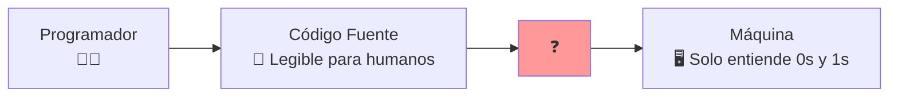

**¿Qué va en el lugar del ❓?**

---

## 🔧 Los Traductores: Nuestros Mediadores

### **Definición:**
Los **traductores** son programas que convierten código escrito en un lenguaje de programación a otro formato que la máquina puede ejecutar.

### **Tipos principales:**
- 🏗️ **Compiladores**
- 🎭 **Intérpretes**
- ⚡ **Compiladores JIT**

---

## 🏗️ Compilación: "Traduce Antes de Enviar"

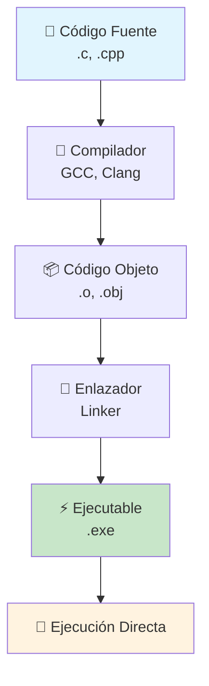

### **Analogía:** Como traducir toda una novela antes de publicarla

---

## 🔍 Proceso Detallado de Compilación

### **Fase de Análisis:**
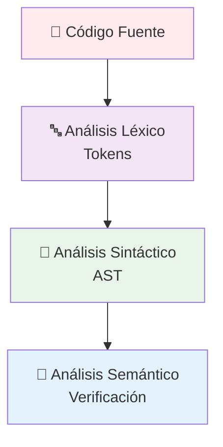

### **Fase de Síntesis:**
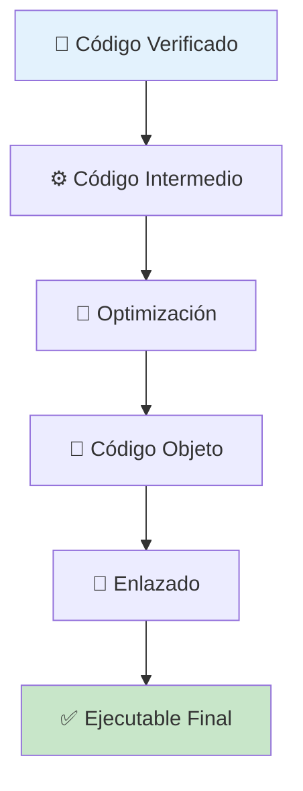

---

## 🎭 Interpretación: "Traduce Mientras Hablas"

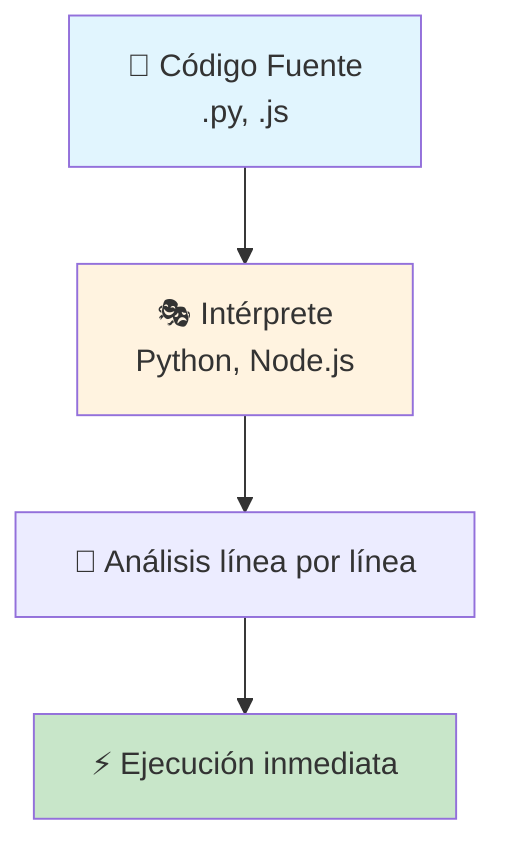

### **Analogía:** Como un intérprete simultáneo en una conferencia

---

## 🤔 Pregunta de reflexión

**¿Cuál creen que será más rápido en ejecución?**

- 🏗️ **¿Un programa compilado (como C)?**
- 🎭 **¿Un programa interpretado (como Python)?**

**¿Por qué?**

---

## ⚡ Compilación JIT: "Lo Mejor de Ambos Mundos"

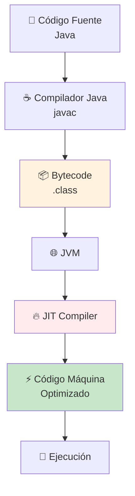

### **¿Qué hace especial al JIT?**
- 🧠 **Aprende** mientras ejecuta
- 🎯 **Optimiza** las partes más usadas
- ⚡ **Mejora** el rendimiento con el tiempo

---

## 📊 Comparación de Enfoques

| Aspecto | Compilación | Interpretación | JIT |
|---------|-------------|----------------|-----|
| **Velocidad inicial** | 🐌 Lenta (compilar) | ⚡ Rápida | ⚡ Rápida |
| **Velocidad ejecución** | 🚀 Muy rápida | 🐌 Lenta | 🚀 Rápida (mejora) |
| **Portabilidad** | ❌ Baja | ✅ Alta | ✅ Alta |
| **Detección errores** | ✅ Antes de ejecutar | ❌ Durante ejecución | ⚠️ Durante ejecución |
| **Memoria necesaria** | ✅ Baja | ⚠️ Media | ❌ Alta |

---

## 🔄 Transpilación: Caso Especial

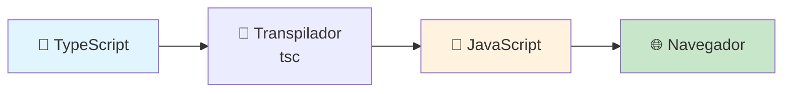

### **¿Cuándo se usa?**
- **TypeScript** → JavaScript
- **Sass** → CSS
- **Kotlin** → JavaScript

---

## 🤔 Pregunta de transición

**Ahora que sabemos CÓMO se traducen los programas...**

**¿Todos los lenguajes se comportan igual?**
**¿Qué características diferencian unos lenguajes de otros?**

---

## 🎨 Lenguajes de Programación: La Diversidad

### **Analogía: Herramientas para Diferentes Trabajos**

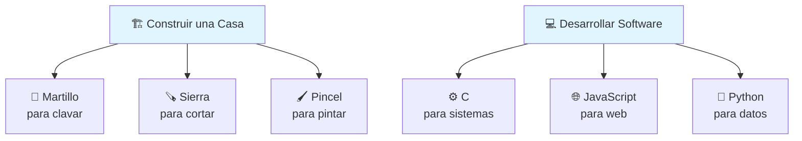

---

## 📋 Elementos Comunes de los Lenguajes

### **Todo lenguaje necesita:**

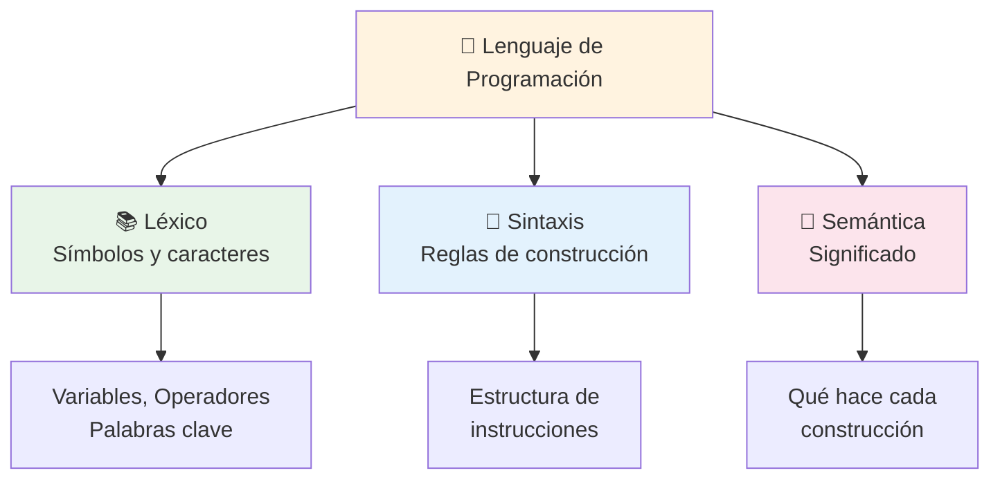

---

## 🚀 Clasificación 1: Modo de Ejecución

### **¿Recordáis los traductores? ¡Aquí se aplican!**

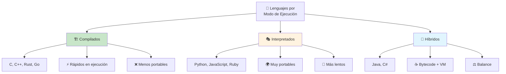

---

## 🏔️ Clasificación 2: Nivel de Abstracción

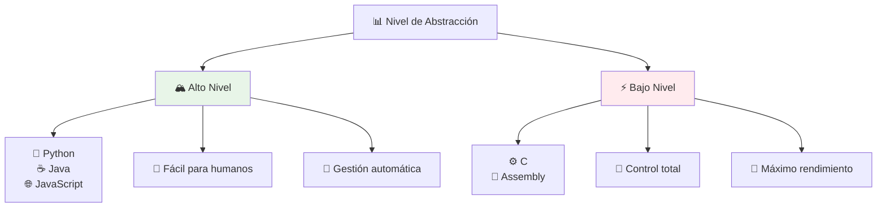

### **Ejemplo Visual:**
```python
# Alto nivel (Python)
resultado = suma(5, 3)
```

```assembly
; Bajo nivel (Assembly)
MOV AX, 0005h
MOV BX, 0003h
ADD AX, BX
```

---

## 🧭 Clasificación 3: Paradigmas de Programación

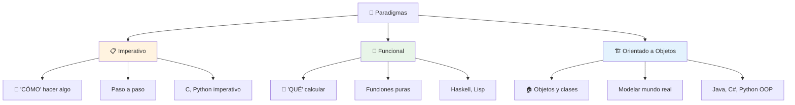

---

## 💼 Ejemplos Prácticos de Paradigmas

### **El mismo problema: Calcular factorial**

#### **Imperativo (C):**
```c
int factorial = 1;
for(int i = 1; i <= n; i++) {
    factorial = factorial * i;  // Modificamos estado
}
```

#### **Funcional (Haskell):**
```haskell
factorial n = if n <= 1 then 1 else n * factorial (n-1)
```

#### **Orientado a Objetos (Java):**
```java
class Calculadora {
    public int factorial(int n) { /* método */ }
}
```

---

## 🎯 Lenguajes Populares y sus Características

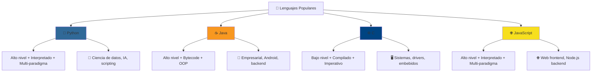

---

## 🤔 Pregunta de elección

**Si tuvieran que desarrollar...**

- 🎮 **Un videojuego de alta velocidad** → ¿Qué lenguaje?
- 🌐 **Una página web interactiva** → ¿Qué lenguaje?
- 🤖 **Un sistema de IA para análisis de datos** → ¿Qué lenguaje?
- 📱 **Una app que funcione en cualquier dispositivo** → ¿Qué lenguaje?

**¿Por qué cada elección?**

---

## 📊 Tendencias Actuales: TIOBE Index

### **Los más demandados (2024):**

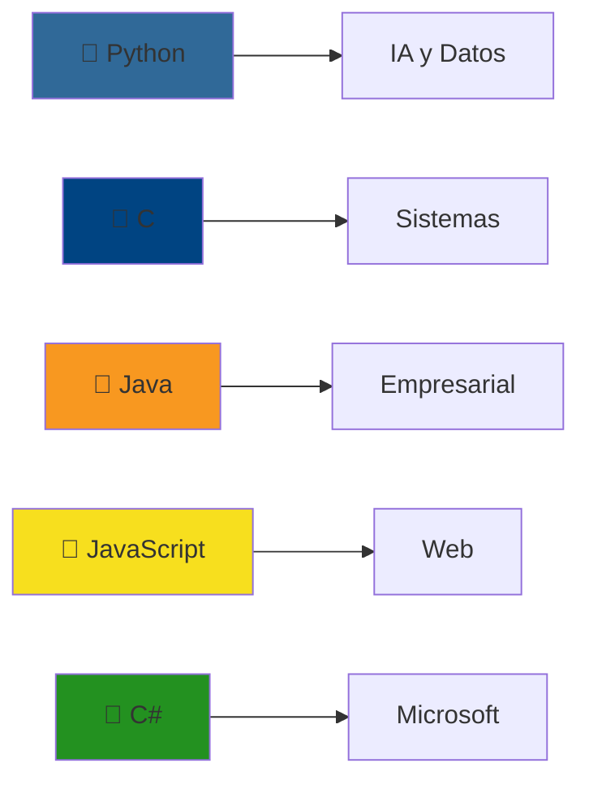

### **Factores que influyen:**
- 🔍 **Búsquedas en Google, Bing, Yahoo**
- 💼 **Demanda laboral**
- 📚 **Cursos y tutoriales**
- 🌐 **Proyectos en GitHub**

---

## 🔗 Conexión: Traductor + Lenguaje = Experiencia

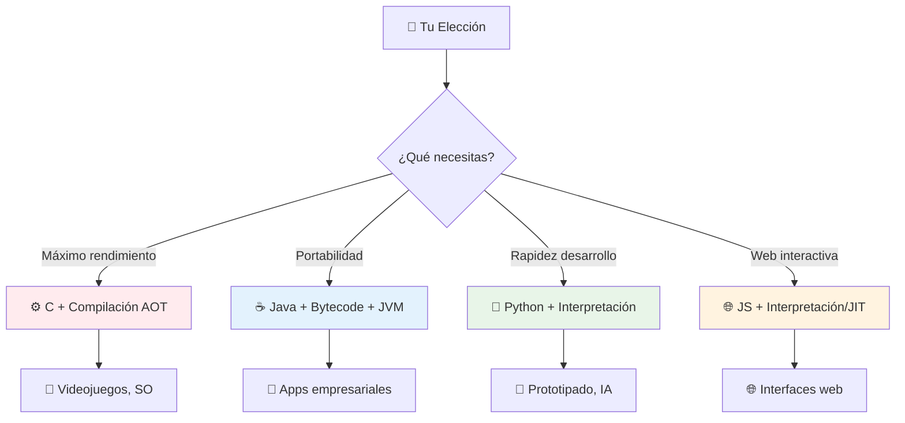

---

## 🧪 Elementos Técnicos de los Lenguajes

### **Componentes que encontramos en todos:**

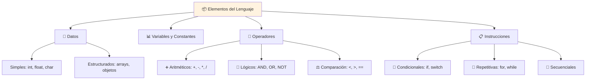

---

## 🔄 Estructuras de Control Universales

### **Condicionales:**
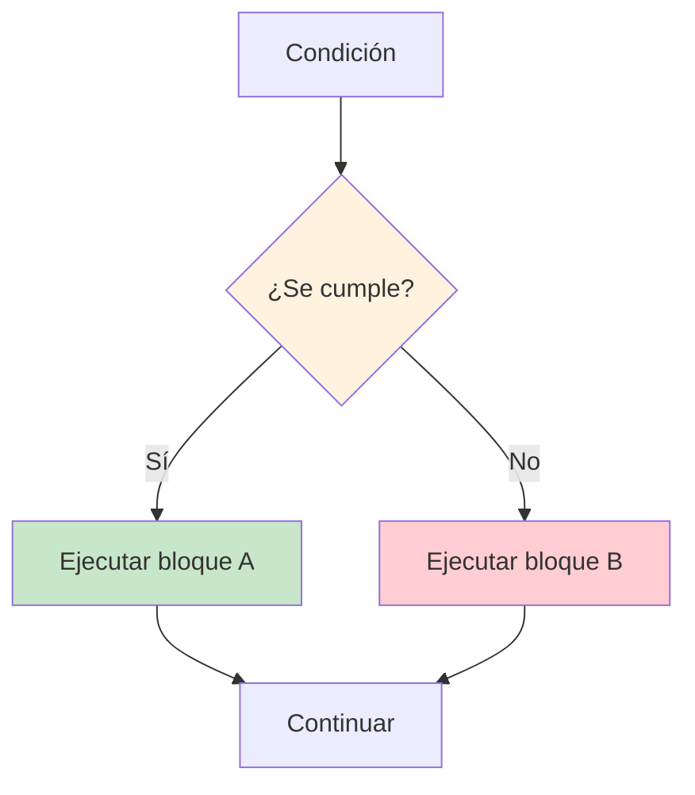

### **Bucles:**
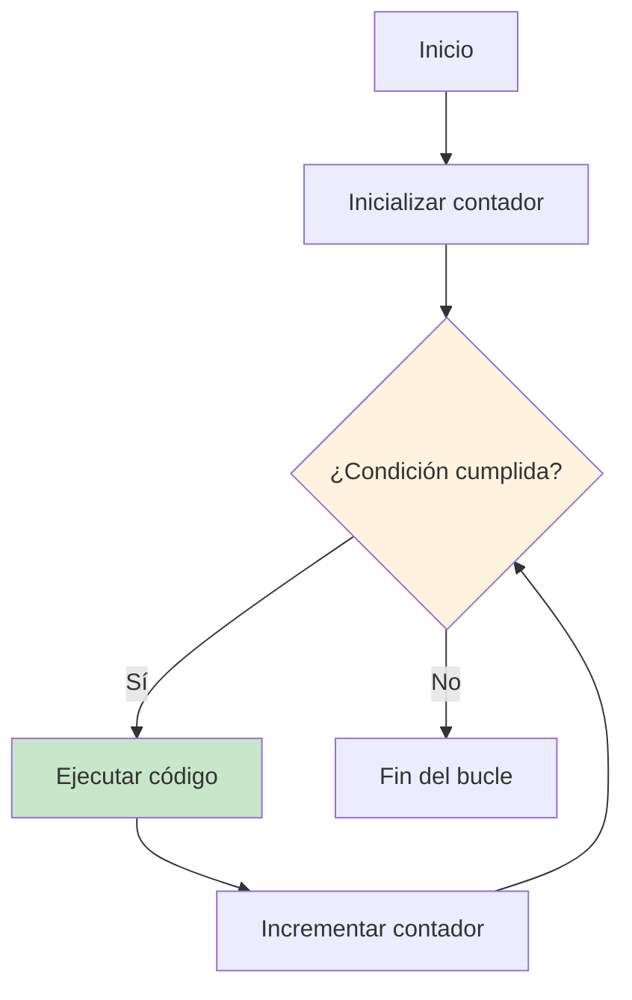

---

## 🌊 Evolución y Frameworks

### **Los lenguajes crecen:**

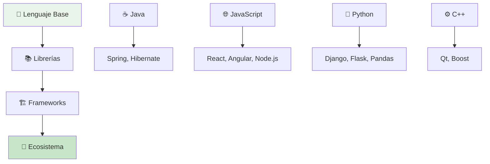

### **¿Por qué es importante?**
- 🚀 **Acelera el desarrollo**
- 🔄 **Reutilización de código**
- 🌍 **Comunidad y soporte**

---

## 🎯 Guía de Decisión: ¿Qué Lenguaje Elegir?

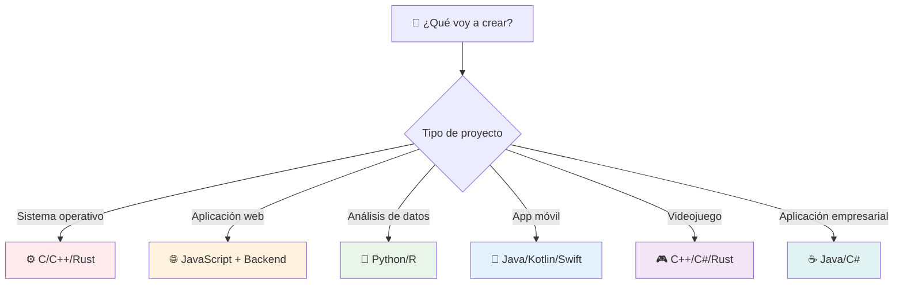

---

## 🔮 El Futuro: Tendencias Emergentes

### **Nuevos lenguajes en auge:**

```mermaid
graph TD
    A[🚀 Lenguajes Emergentes] --> B[🦀 Rust]
    A --> C[🏃 Go]
    A --> D[🎯 Kotlin]
    A --> E[🦋 Dart]
    
    B --> B1[🛡️ Seguridad de memoria + Velocidad C]
    C --> C1[⚡ Concurrencia + Simplicidad]
    D --> D1[☕ Java mejorado + Multiplataforma]
    E --> E1[📱 Flutter + Apps móviles]
    
    style B fill:#ce422b
    style C fill:#00add8
    style D fill:#7f52ff
    style E fill:#0175c2
```

---

## 🧠 Síntesis: Lo que Hemos Aprendido

### **Conexiones Importantes:**

```mermaid
graph TD
    A[👨‍💻 Problema a Resolver] --> B[🎯 Elección de Lenguaje]
    B --> C[🔧 Tipo de Traductor]
    C --> D[⚡ Características de Ejecución]
    D --> E[🚀 Resultado Final]
    
    B1[Velocidad crítica] --> B
    B2[Portabilidad] --> B
    B3[Facilidad desarrollo] --> B
    
    C1[Compilación AOT] --> C
    C2[Interpretación] --> C
    C3[JIT] --> C
    
    style A fill:#fff3e0
    style E fill:#c8e6c9
```

---

## 🎪 Preguntas de Repaso

### **1. Traductores:**
- ¿Cuál es la diferencia entre compilador e intérprete?
- ¿Qué ventajas ofrece JIT sobre compilación tradicional?
- ¿Cuándo usarías transpilación?

### **2. Lenguajes:**
- ¿Qué paradigma elegirías para modelar un sistema bancario?
- ¿Por qué Python es popular en ciencia de datos?
- ¿Qué significa que un lenguaje sea "de alto nivel"?
---
## 🌟 Reflexión Final

### **La Programación es como un Lenguaje Humano:**

```mermaid
graph LR
    A[💭 Idea] --> B[🗣️ Expresión<br/>Lenguaje]
    B --> C[👂 Comprensión<br/>Traductor]
    C --> D[✅ Acción<br/>Ejecución]
    
    E[💡 Algoritmo] --> F[📝 Código<br/>Lenguaje Prog.]
    F --> G[🔧 Compilador/Intérprete]
    G --> H[🚀 Programa<br/>Funcionando]
    
    style A fill:#fff3e0
    style E fill:#fff3e0
    style D fill:#c8e6c9
    style H fill:#c8e6c9
```

### **Mensaje clave:**
> **"No existe el lenguaje perfecto, solo el lenguaje adecuado para cada problema"**

---

## 🎯 Ejemplo practico

### **Preparación:**
- 🛠️ **Instalar:** GCC, Java JDK, Python
- 📝 **Escribir:** El mismo programa en C, Java y Python
- 🔍 **Observar:** Las diferencias en compilación/ejecución
- 🤔 **Reflexionar:** ¿Cuál fue más fácil? ¿Cuál más rápido?

### **Preguntas para investigar:**
- ¿Qué otros transpiladores existen además de TypeScript?
- ¿Cómo funciona internamente la JVM?
- ¿Qué lenguajes usan las empresas tecnológicas grandes?

---

## ❓ ¿Preguntas?

### **Temas para discutir:**
- 🤝 **Experiencias personales** con lenguajes
- 🔍 **Dudas sobre conceptos** específicos
- 🎯 **Recomendaciones** para proyectos personales
- 🚀 **Perspectivas futuras** de la programación

---

**¡Gracias por vuestra atención!**

*"Cada lenguaje de programación es una herramienta diferente en la caja de herramientas del desarrollador. Cuantas más herramientas conozcas, mejor podrás elegir la adecuada para cada trabajo."* 🧰✨