# Diagramas de clases UML - Ejercicios II

Documento generado a partir del archivo **EDES-U4.2-Ejercicios-II.md**.

Cada ejercicio incluye:

1. Una tabla previa de análisis de clases.
2. Un diagrama UML en sintaxis PlantUML.

> Nota didáctica: las soluciones propuestas no son únicas. En UML puede haber varias decisiones válidas si están justificadas. Aquí se ha priorizado una solución clara, razonable y adecuada para alumnado que está empezando a modelar orientación a objetos.

---

# 1. Sistema de Reserva de Vuelos

## Tabla de clases

| Clase | Tipo de clase | Responsabilidad | Atributos principales |
|---|---|---|---|
| SistemaReservas | Gestora / contexto | Coordinar la búsqueda de vuelos y la creación de reservas | vuelos: List<Vuelo>, reservas: List<Reserva> |
| Cliente | Entidad | Representar al pasajero registrado en el sistema | idCliente, nombre, apellidos, email |
| Vuelo | Entidad | Guardar los datos del vuelo y permitir consultar disponibilidad | numero, origen, destino, fecha, horaSalida, horaLlegada |
| Asiento | Entidad | Representar cada plaza concreta que puede reservarse | numero, clase, disponible |
| Reserva | Entidad | Representar la reserva realizada por un cliente para un vuelo y asiento | codigo, fechaReserva, estado |
| Pago | Entidad | Guardar la información de confirmación del pago | idPago, importe, fechaPago, estado |
| TarjetaCredito | Entidad | Representar los datos necesarios para realizar el pago | titular, numeroEnmascarado, fechaCaducidad |

## Diagrama UML

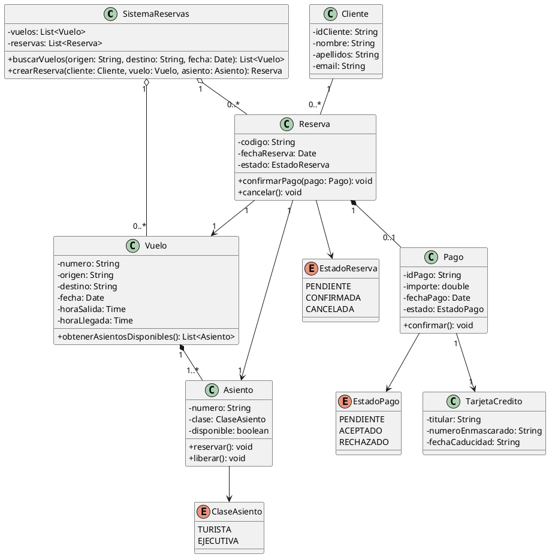

---

# 2. Matrimonios

## Tabla de clases

| Clase | Tipo de clase | Responsabilidad | Atributos principales |
|---|---|---|---|
| RegistroMatrimonios | Gestora / contexto | Almacenar y gestionar los matrimonios civiles registrados | matrimonios: List<Matrimonio> |
| Matrimonio | Entidad | Representar el acto civil celebrado | fecha, lugarCelebracion |
| Persona | Entidad base | Recoger los datos comunes de las personas participantes | nombre, apellidos, edad, sexo, domicilio |
| Contrayente | Entidad | Representar a una de las dos personas que contraen matrimonio | hereda de Persona |
| Testigo | Entidad | Representar a uno de los dos testigos del matrimonio | hereda de Persona |
| AutoridadCivil | Entidad | Representar al juez o autoridad municipal que formaliza el acto | cargo |

## Diagrama UML

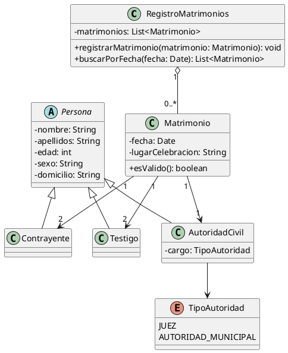

---

# 3. Empresa

## Tabla de clases

| Clase | Tipo de clase | Responsabilidad | Atributos principales |
|---|---|---|---|
| Empresa | Contexto / gestora | Agrupar empleados y clientes de la empresa | nombre, empleados: List<Empleado>, clientes: List<Cliente> |
| Persona | Entidad base | Recoger los datos comunes de empleados y clientes | nombre, edad |
| Empleado | Entidad | Representar a un trabajador de la empresa | sueldoBruto |
| Directivo | Entidad especializada | Representar a un empleado con categoría y subordinados | categoria, subordinados: List<Empleado> |
| Cliente | Entidad | Representar a un cliente de la empresa | telefono |
| Mostrable | Interfaz | Definir la operación de mostrar datos | mostrarDatos() |

## Diagrama UML

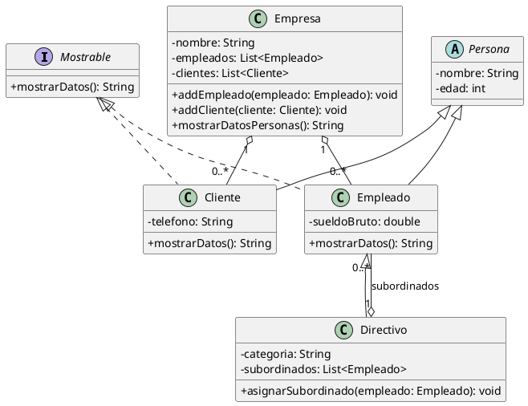

---

# 4. Viajes (I)

## Tabla de clases

| Clase | Tipo de clase | Responsabilidad | Atributos principales |
|---|---|---|---|
| CompaniaViajes | Contexto / gestora | Gestionar los vuelos ofertados y la flota de aviones | nombre, vuelos: List<Vuelo>, aviones: List<Avion> |
| Vuelo | Entidad | Representar un vuelo ofertado en una fecha concreta | codigo, fecha, origen, destino, numeroPlazas |
| Avion | Entidad | Representar un avión de la flota | matricula, modelo, capacidad |
| Persona | Entidad | Representar a la persona que compra un billete | nombre, apellidos, edad |
| Billete | Entidad | Representar la compra de un asiento para un vuelo | codigo, numeroAsiento, fechaCompra |

## Diagrama UML

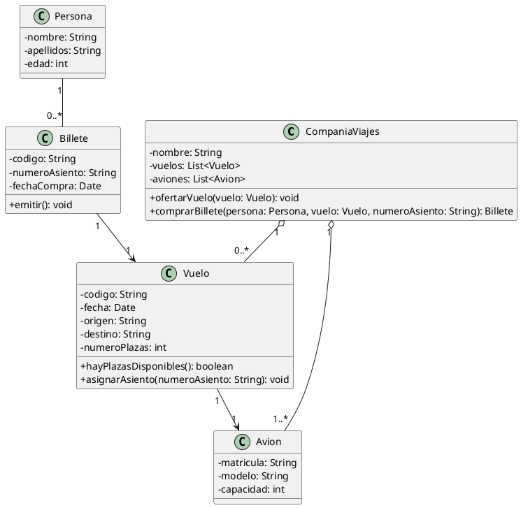

---

# 5. Biblioteca (I)

## Tabla de clases

| Clase | Tipo de clase | Responsabilidad | Atributos principales |
|---|---|---|---|
| Biblioteca | Contexto / gestora | Gestionar copias, lectores, préstamos, devoluciones y multas | nombre, copias, lectores, prestamos |
| Libro | Entidad | Representar la obra bibliográfica | nombre, tipo, editorial, anio |
| Autor | Entidad | Representar al autor de un libro | nombre, nacionalidad, fechaNacimiento |
| Copia | Entidad | Representar un ejemplar físico concreto de un libro | identificador, estado |
| Lector | Entidad | Representar al usuario que puede tomar libros prestados | idLector, nombre, diasBloqueo |
| Prestamo | Entidad | Representar el préstamo de una copia a un lector | fechaInicio, fechaDevolucionPrevista, fechaDevolucionReal |
| Multa | Entidad | Representar la penalización por retraso | diasPenalizacion, fechaInicio, fechaFin |

## Diagrama UML

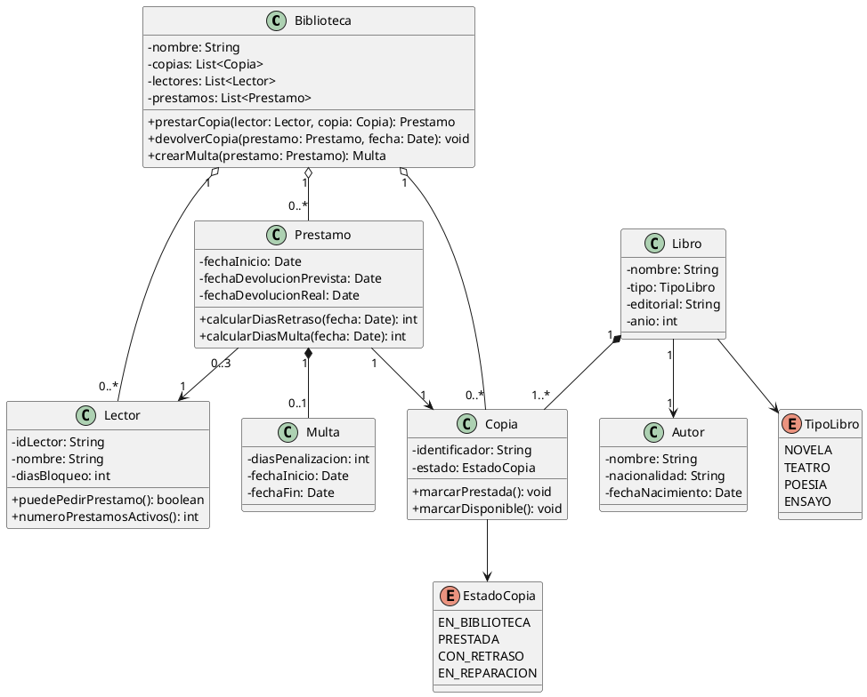

---

# 6. Sistema de Clínica Veterinaria

## Tabla de clases

| Clase | Tipo de clase | Responsabilidad | Atributos principales |
|---|---|---|---|
| ClinicaVeterinaria | Contexto / gestora | Gestionar dueños, mascotas, citas, visitas y veterinarios | nombre, mascotas, veterinarios, citas |
| Dueno | Entidad | Representar al propietario de una o varias mascotas | idDueno, nombre, telefono |
| Mascota | Entidad | Representar al animal atendido por la clínica | idMascota, nombre, especie, raza, fechaNacimiento |
| HistorialMedico | Entidad / composición | Agrupar visitas, tratamientos y vacunas de una mascota | fechaCreacion |
| Visita | Entidad | Registrar una atención veterinaria concreta | fecha, motivo, diagnostico |
| Tratamiento | Entidad | Representar un tratamiento aplicado o recomendado | descripcion, fechaInicio, fechaFin |
| Vacuna | Entidad | Representar una vacuna administrada | nombre, fechaAdministracion, proximaDosis |
| Veterinario | Entidad | Representar al profesional que atiende mascotas | idVeterinario, nombre, especialidad |
| Medicamento | Entidad | Representar un medicamento prescrito | nombre, dosisRecomendada |
| Prescripcion | Entidad asociativa | Relacionar tratamiento, medicamento y veterinario | dosis, frecuencia, duracion |
| Cita | Entidad | Representar una cita de seguimiento | fechaHora, motivo, estado |

## Diagrama UML

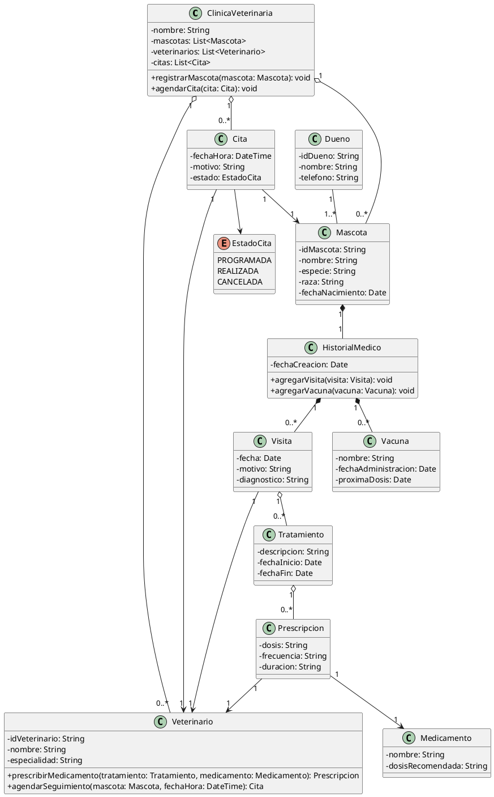

---

# 7. Gestión de pedidos

## Tabla de clases

| Clase | Tipo de clase | Responsabilidad | Atributos principales |
|---|---|---|---|
| SistemaPedidos | Contexto / gestora | Gestionar clientes, productos y pedidos | clientes, productos, pedidos |
| Cliente | Entidad | Representar al cliente que realiza pedidos | idCliente, nombre, email |
| Pedido | Entidad | Representar un pedido formalizado por un cliente | numero, fecha, estado |
| LineaPedido | Entidad asociativa | Representar un producto concreto dentro del pedido con cantidad e impuestos | cantidad, impuesto |
| Producto | Entidad | Representar un producto vendible | codigo, nombre, precio |
| Inventario | Gestora | Controlar las existencias de productos | existencias |
| ExistenciaProducto | Entidad asociativa | Guardar el stock disponible de cada producto | stockActual, stockMinimo |

## Diagrama UML

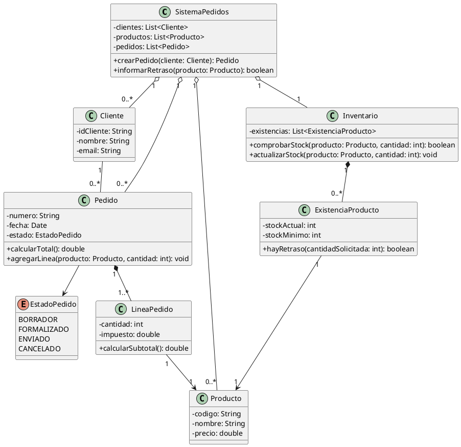

---

# 8. Biblioteca (II)

## Tabla de clases

| Clase | Tipo de clase | Responsabilidad | Atributos principales |
|---|---|---|---|
| Biblioteca | Contexto / gestora | Gestionar libros, copias, socios, préstamos históricos y multas | nombre, libros, copias, socios, prestamos, multas |
| Libro | Entidad | Representar una obra que puede tener varios autores | titulo, tipo, editorial, anio |
| Autor | Entidad | Representar a un autor | nombre, nacionalidad, fechaNacimiento |
| AutorLibro | Entidad asociativa | Guardar la relación entre libro y autor incluyendo el orden | orden |
| Copia | Entidad | Representar un ejemplar físico del libro | identificador, estado |
| Socio | Entidad | Representar al usuario de la biblioteca | idSocio, nombre |
| Prestamo | Entidad | Guardar cada préstamo, tanto activo como histórico | fechaInicio, fechaPrevista, fechaDevolucionReal, estado |
| Multa | Entidad | Guardar las multas impuestas a socios | diasPenalizacion, fechaInicio, fechaFin, estado |

## Diagrama UML

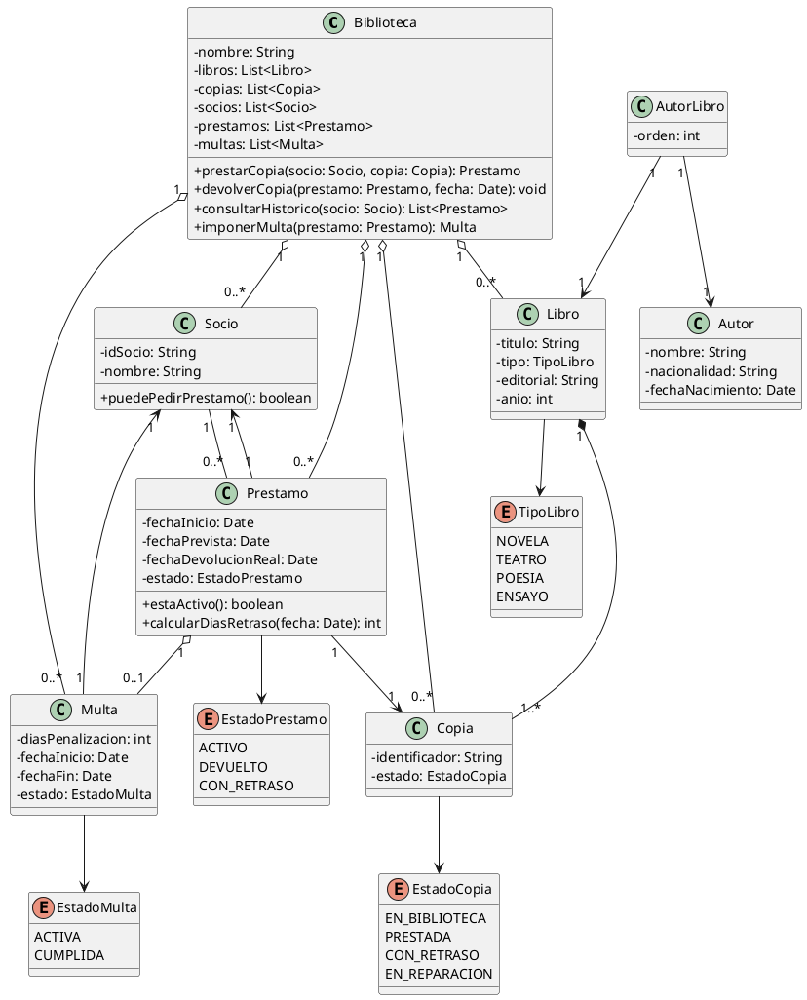

---

# 9. Redes de computadores

## Tabla de clases

| Clase | Tipo de clase | Responsabilidad | Atributos principales |
|---|---|---|---|
| Red | Contexto / gestora | Agrupar y gestionar los elementos conectados de la red | nombre, elementos |
| ElementoRed | Entidad abstracta | Definir los datos comunes de cualquier elemento de red | id, direccionIP |
| Equipo | Entidad abstracta | Representar elementos capaces de generar mensajes | nombre |
| Servidor | Entidad | Representar un servidor conectado a uno o varios conmutadores | servicio |
| PC | Entidad | Representar un ordenador personal conectado a un único conmutador | usuario |
| Impresora | Entidad | Representar una impresora que puede averiarse | modelo, probabilidadAveria, tiempoAveria |
| Conmutador | Entidad | Representar un switch con puertos y probabilidad de pérdida de mensajes | numeroPuertos, probabilidadPerdida |
| Puerto | Entidad | Representar cada puerto físico del conmutador | numero, ocupado |
| Mensaje | Entidad | Representar un mensaje generado por servidores o PCs | idMensaje, tamanio |

## Diagrama UML

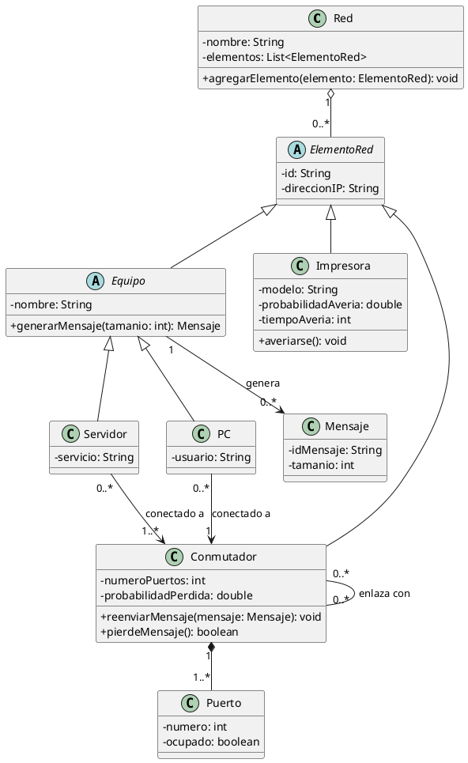

---

# 10. Proyectos

## Tabla de clases

| Clase | Tipo de clase | Responsabilidad | Atributos principales |
|---|---|---|---|
| Proyecto | Contexto / gestora | Gestionar ciclos de desarrollo y medir el avance global | nombre, fechaInicio, estadoAvance |
| CicloDesarrollo | Entidad | Representar un ciclo que termina en una versión ejecutable | numero, fechaInicio, fechaFin |
| VersionEjecutable | Entidad | Representar el resultado ejecutable de un ciclo | numeroVersion, fechaPublicacion |
| Fase | Entidad | Representar una fase del proceso unificado | tipo, fechaInicio, fechaFin |
| Iteracion | Entidad | Agrupar actividades y producir artefactos | numero, fechaInicio, fechaFin, porcentajeAvance |
| Actividad | Entidad | Representar una tarea con duración y recursos | nombre, duracionHoras |
| Recurso | Entidad abstracta | Representar recursos necesarios para actividades | nombre |
| RecursoHumano | Entidad | Representar personas que participan en actividades | rol |
| RecursoMaterial | Entidad | Representar materiales o herramientas necesarias | tipo |
| Artefacto | Entidad | Representar productos generados por iteraciones | nombre, tipo, fechaCreacion |

## Diagrama UML

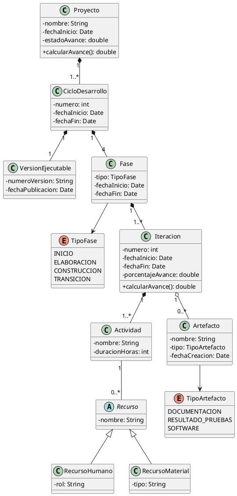

---

# 11. Conferencias científicas

## Tabla de clases

| Clase | Tipo de clase | Responsabilidad | Atributos principales |
|---|---|---|---|
| SistemaConferencias | Contexto / gestora | Gestionar varias conferencias simultáneamente | conferencias: List<Conferencia> |
| Conferencia | Entidad | Representar una conferencia científica | nombre, fechaInicio, fechaFin, plazoEnvio, plazoRevision |
| Persona | Entidad base | Recoger datos comunes de autores, revisores y chairmen | nombre, email, afiliacion |
| Autor | Entidad | Representar a quien firma un artículo | hereda de Persona |
| Revisor | Entidad | Representar a quien evalúa artículos | areaEspecialidad |
| Chairman | Entidad | Representar a quien toma decisiones sobre artículos | hereda de Persona |
| Articulo | Entidad | Representar un artículo enviado a una conferencia | titulo, resumen, fechaEnvio, estado |
| AutorArticulo | Entidad asociativa | Relacionar autores y artículos, indicando autor de correspondencia y orden | ordenFirma, esCorrespondencia |
| Revision | Entidad | Representar la evaluación de un artículo por un revisor | puntuacion, comentario, fechaRevision |
| Decision | Entidad | Representar la aceptación o rechazo de un artículo | resultado, fechaDecision, comentario |

## Diagrama UML

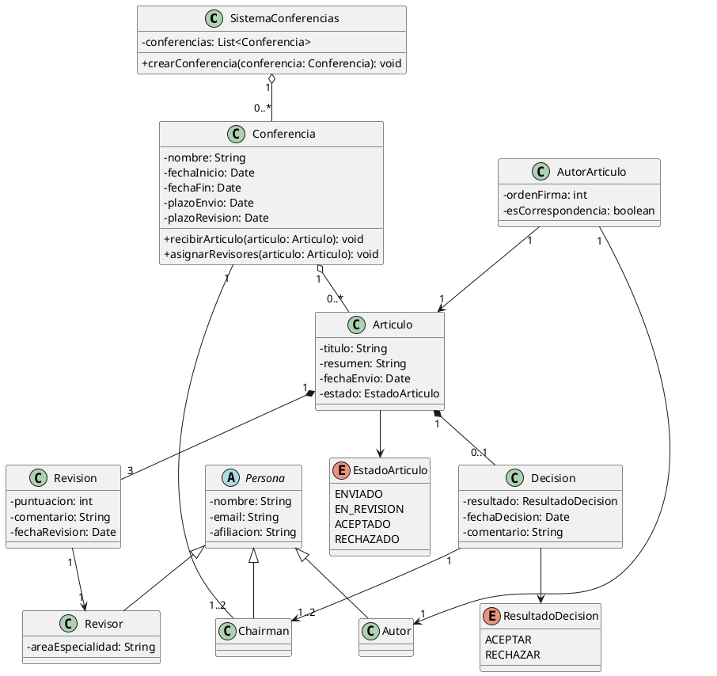

---

# 12. Red Social Simple

## Tabla de clases

| Clase | Tipo de clase | Responsabilidad | Atributos principales |
|---|---|---|---|
| RedSocial | Contexto / gestora | Gestionar usuarios, publicaciones y notificaciones | usuarios, publicaciones |
| Usuario | Entidad | Representar a un usuario que crea perfil, publica, sigue y da me gusta | idUsuario, nombreUsuario, email |
| Perfil | Entidad | Guardar la información pública del usuario | nombreVisible, biografia, fotoPerfil |
| Publicacion | Entidad | Representar una publicación con texto, imágenes o ambos | idPublicacion, texto, fechaPublicacion |
| Imagen | Entidad | Representar una imagen asociada a una publicación | url, descripcion |
| Seguimiento | Entidad asociativa | Representar la relación usuario-usuario cuando alguien sigue a otro | fechaInicio |
| MeGusta | Entidad asociativa | Representar el “me gusta” de un usuario a una publicación | fecha |
| Notificacion | Entidad | Representar una notificación generada por actividad social | mensaje, fecha, leida |
| ServicioNotificaciones | Controladora | Crear y enviar notificaciones cuando ocurre una actividad | notificacionesPendientes |
| Actividad | Entidad | Representar una acción que puede generar notificación | tipo, fecha |

## Diagrama UML

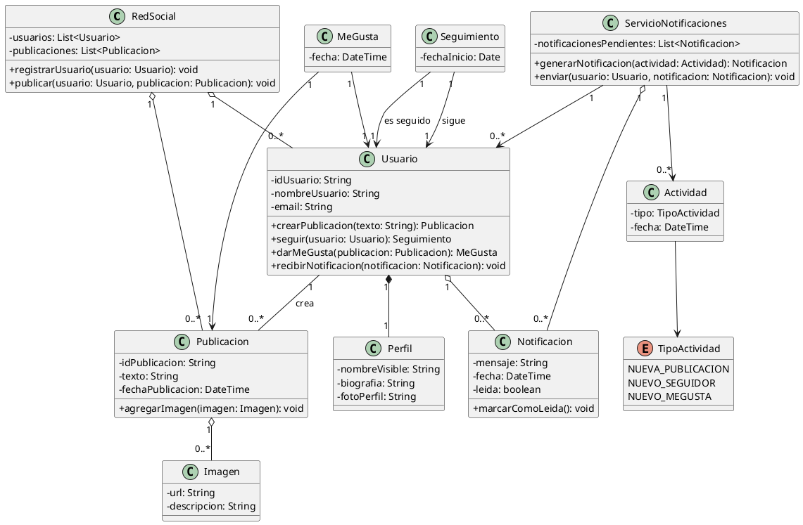

---

# Observaciones finales para el alumnado

- Una **clase entidad** representa información importante del dominio: Cliente, Pedido, Libro, Vuelo.
- Una **clase gestora** coordina operaciones sobre varias entidades: Biblioteca, SistemaReservas, SistemaPedidos.
- Una **clase controladora** suele coordinar un proceso concreto: ServicioNotificaciones.
- Una **clase contexto** representa el sistema o ámbito general donde viven las entidades: RedSocial, Proyecto, Empresa.
- Una **clase asociativa** aparece cuando una relación necesita guardar datos propios. Por ejemplo:
  - AutorLibro guarda el orden de los autores de un libro.
  - LineaPedido guarda cantidad e impuestos de un producto dentro de un pedido.
  - MeGusta guarda cuándo un usuario dio me gusta a una publicación.
  - Seguimiento guarda cuándo un usuario empezó a seguir a otro.
- Los atributos deben colocarse en la clase que realmente es responsable de conocer ese dato.
- Los métodos deben colocarse en la clase que tiene la información suficiente para realizar esa acción.
