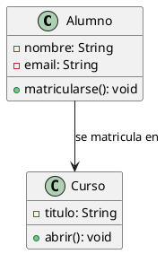
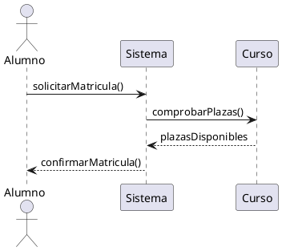

# Introducción a UML
## Unified Modeling Language

**Entornos de Desarrollo - 1º DAW**  
Unidad 3.1


---

# Índice del tema

1. Introducción
2. Qué es UML
3. Qué es modelar
4. Propósito e importancia del modelado
5. Por qué usar UML
6. Características principales
7. Ventajas y desventajas
8. Diagramas UML y clasificación
9. Historia de UML
10. Alternativas a UML
11. Principios de buen modelado
12. Herramientas UML
13. UML en el desarrollo ágil
14. Conclusiones y recursos

---

# 1. Introducción

El **Lenguaje Unificado de Modelado** o **UML** (*Unified Modeling Language*) es un lenguaje estandarizado de modelado.

Está especialmente desarrollado para ayudar, a todos los intervinientes en el desarrollo y modelado de un sistema o un producto software, a:

- **describir**
- **diseñar**
- **especificar**
- **visualizar**
- **construir**
- **documentar**

todos los artefactos que lo componen, sirviéndose de varios tipos de diagramas.

> **Principio fundamental de UML:** una imagen vale más que mil palabras.

---

# 2. ¿Qué es UML?

UML nos permite representar visualmente los diferentes aspectos de un sistema software mediante diagramas.

Antes de profundizar en sus características, es importante entender:

- qué lo hace especial
- por qué se ha convertido en el estándar de facto en la industria

---

# 2.1 Definición

UML, del inglés **Unified Modeling Language** (*Lenguaje Unificado de Modelado*), es un lenguaje de modelado visual estándar utilizado en ingeniería de software para:

- **especificar**
- **visualizar**
- **construir**
- **documentar**

los artefactos de un sistema software.

En esencia, UML es **un lenguaje visual que nos permite comunicar ideas complejas sobre sistemas software de una manera que todos los implicados en el proyecto pueden entender**, independientemente de su rol.

---

# Atención

> UML **NO es un lenguaje de programación**, sino un **medio de comunicación** que trasciende los lenguajes de programación específicos.

---

# UML permite...

- **Describir** sistemas software de forma clara y completa, capturando todos los aspectos relevantes.
- **Diseñar** la arquitectura de aplicaciones antes de invertir recursos en codificación.
- **Especificar** comportamientos y estructuras con precisión, evitando ambigüedades.
- **Visualizar** componentes del sistema y sus interacciones en múltiples perspectivas.
- **Construir** aplicaciones de forma planificada, basándose en diseños validados.
- **Documentar** el desarrollo del software, creando un registro permanente de las decisiones de diseño.

---

# 2.2 ¿Qué es modelar?

Puesto que UML es un lenguaje de modelado, es crucial entender qué significa **modelar** en el contexto del desarrollo de software.

**Modelar** consiste en crear una representación abstracta y simplificada de la realidad que queremos construir, destacando los aspectos más importantes e ignorando los detalles irrelevantes.

En el contexto del software, modelar significa diseñar la estructura y el comportamiento de una aplicación antes de implementarla.

---

# Modelar: analogía con el mundo real

De la misma forma que un arquitecto dibuja y diseña planos detallados sobre el edificio que va a construir —especificando cimientos, estructura, dimensiones y materiales—, un analista de software crea distintos diagramas UML que sirven de base para la posterior construcción y mantenimiento del sistema.

- El arquitecto no comienza a construir directamente.
- Primero hace planos.
- Del mismo modo, en software, es prudente diseñar primero.

---

# ¿Por qué conviene modelar primero?

La razón es simple pero poderosa:

**los cambios en los planos son más baratos y rápidos que los cambios una vez la construcción ha comenzado**.

Una pequeña corrección en un diagrama puede ahorrar:

- semanas de recodificación
- refactorización innecesaria
- malentendidos de diseño

> **Consejo:** en un modelado, destaca los aspectos más importantes e ignora los detalles irrelevantes.

---

# 2.2.1 Propósito del modelado

El modelado es la principal forma de **visualizar el diseño** de una aplicación con la finalidad de compararla con los requisitos **antes** de que el equipo de desarrollo comience a codificar.

Al modelar, obtenemos varios beneficios.

---

# Beneficios del modelado (I)

1. **Verificación temprana**  
   Podemos verificar que nuestro diseño satisface todos los requisitos antes de escribir la primera línea de código.

2. **Comunicación clara**  
   Un diagrama bien hecho comunica la idea mucho mejor que cientos de líneas de código o documentación textual.

---

# Beneficios del modelado (II)

3. **Base para la implementación**  
   El modelo sirve como guía para el equipo de desarrollo, reduciendo la ambigüedad y los malentendidos.

4. **Documentación duradera**  
   Los diagramas permanecen como documentación después de que el código evoluciona.

---

# 3. Importancia del modelado en el ciclo de vida del software

El modelado es vital en todo tipo de proyectos, pero cobra especial importancia a medida que el proyecto crece de tamaño.

Mientras que en un proyecto pequeño los desarrolladores podrían resolver los problemas de diseño sobre la marcha, en proyectos grandes y complejos, la ausencia de un diseño claro conduce a:

- caos
- inconsistencia
- costos exponenciales

---

# Escenario típico

Imagina que debes construir un sistema para una empresa mediana con múltiples equipos de desarrollo.

Sin un diseño claro, cada equipo haría suposiciones diferentes sobre:

- la estructura del código
- los patrones de comunicación entre componentes
- cómo los datos fluyen a través del sistema

**El resultado** serían incoherencias que requerirían costosas refactorizaciones posteriormente.

---

# Con UML...

Todos los equipos entienden exactamente:

- cómo se estructura el sistema
- qué componentes existen
- cómo se comunican
- cuáles son sus responsabilidades

---

# Beneficios concretos del modelado

- Permite diseñar para la **escalabilidad** desde el inicio, identificando puntos de crecimiento.
- Garantiza la **seguridad** del sistema al identificar vulnerabilidades en la fase de diseño.
- Verifica la correcta **ejecución** antes de implementar, evitando cambios costosos.
- Los cambios son **menos costosos** en fase de diseño que durante o después de la implementación.

---

# Más beneficios concretos del modelado

- Facilita la **comunicación** entre el equipo, reduciendo malentendidos.
- Permite **reutilización** de componentes bien diseñados en proyectos futuros.
- Mejora la **calidad** general del software, resultando en menos defectos.
- Reduce el **tiempo de mantenimiento** posterior.

> **Importante:** utilizando diagramas UML se consigue visualizar y verificar los diseños de sistemas de software antes de que la implementación del código haga que los cambios sean difíciles y demasiado costosos.

---

# 4. ¿Por qué usar UML?

La principal razón para usar UML es que proporciona un **lenguaje visual estándar** que todos los miembros del equipo pueden entender, independientemente de su experiencia técnica o rol en el proyecto.

Además, es un lenguaje ampliamente aceptado en la industria del software, lo que significa que si cambias de empresa, los conceptos que ya conoces seguirán siendo válidos.

Pero hay razones mucho más profundas por las que UML es tan importante.

---

# 4.1 Abstracción y flexibilidad

Los modelos o diagramas de UML nos ayudan a trabajar a un **mayor nivel de abstracción**.

Esto es crucial porque permite que nos concentremos en los conceptos importantes sin perdernos en los detalles técnicos.

**¿Qué significa abstracción?**  
Ignorar deliberadamente los detalles que no importan para el problema en cuestión y enfocarse en lo que sí importa.

---

# Ejemplo de abstracción

Cuando diseñamos un sistema de tienda online, podemos abstraer **cómo funciona el navegador web** y simplemente decir:

- hay un cliente que accede al sistema
- realiza acciones
- recibe respuestas

Nos centramos en la lógica del sistema, no en todos los detalles técnicos secundarios.

---

# 4.2 Independencia tecnológica

Una de las características más poderosas de UML es que es **completamente independiente de la tecnología específica que uses**.

- **Independencia del lenguaje de programación**: puedes usar un diagrama UML para diseñar un sistema en Java, Python, C#, Kotlin o cualquier otro lenguaje.
- **Independencia del sistema operativo**: ya sea Windows, Linux, macOS o cualquier otro, el diseño UML es válido.

---

# Independencia tecnológica (continuación)

- **Independencia del hardware**: el diagrama se aplica tanto a sistemas que corren en una PC como en servidores en la nube.
- **Independencia de la red**: sea que el sistema sea monolítico o distribuido, UML puede modelarlo.
- **Independencia del contexto**: UML puede modelar incluso proyectos que no son puramente software, como sistemas empresariales o procesos de negocio.

**¿Por qué esto importa?** Porque significa que tu inversión en aprender UML no está ligada a una tecnología específica que podría volverse obsoleta. El conocimiento es transferible.

---

# Ejemplo práctico

Imagina que diseñas una aplicación de gestión de tareas.

- Hoy la implementas con **backend en Java** y **frontend web**.
- Dentro de unos años, la arquitectura cambia y decides migrar la implementación.

El diagrama UML que creaste **sigue siendo válido**, porque describe la lógica del negocio, no los detalles tecnológicos.

---

# 5. Características principales que hacen de UML un estándar

Las características que hacen de UML un lenguaje de modelado tan popular y duradero son multifacéticas y responden a necesidades reales de los equipos de desarrollo.

---

# 5.1 Sencillez

Aunque UML puede parecer complejo a primera vista cuando ves todos los 14 tipos de diagramas posibles, la realidad es que **la mayoría de proyectos solo usan 3 o 4 tipos de diagramas**.

UML está diseñado de forma modular:

- usas lo que necesites
- nada más

---

# ¿Por qué la sencillez es una ventaja?

Porque significa que no necesitas ser un experto en UML para empezar a usarlo.

- Un equipo junior puede crear diagramas de clases útiles.
- No hace falta dominar toda la especificación de 600+ páginas.

---

# 5.2 Versatilidad

UML no está limitado a un tipo específico de sistema o arquitectura. Es capaz de modelar:

- **aplicaciones monolíticas**
- **sistemas distribuidos**
- **aplicaciones web**
- **sistemas embebidos**
- **sistemas empresariales**
- **aplicaciones móviles**
- **sistemas híbridos**

Esto significa que el conocimiento de UML que adquieres es aplicable en casi cualquier contexto en el que trabajes.

---

# 5.3 Universalidad

UML crea un **lenguaje común** que trasciende roles, ámbitos y especialidades.

Imagina una reunión de proyecto con:

- el arquitecto técnico
- el especialista en bases de datos
- el analista de negocio
- el tester

Sin UML, cada uno hablaría su propio lenguaje y habría confusiones constantes.

---

# Cómo funciona la universalidad en la práctica

Con UML, todos pueden mirar el mismo diagrama de clases y comprender qué se está representando, adaptando la interpretación a su dominio específico:

- el arquitecto ve la estructura de componentes
- el especialista en BD ve las entidades y sus relaciones
- el analista ve los procesos del negocio
- el tester ve qué necesita verificar

---

# 5.4 Extensibilidad

UML no es un sistema cerrado.

Proporciona mecanismos para **especializar y extender** los conceptos fundamentales cuando tus necesidades específicas requieren más allá de lo que UML estándar ofrece.

**Ejemplo:** si modelas un sistema de telecomunicaciones con requisitos muy específicos, puedes crear tus propias extensiones de UML que representen conceptos del dominio. La estructura base de UML sigue siendo válida.

---

# 6. Ventajas y desventajas: un análisis equilibrado

La adopción de UML como lenguaje conlleva una serie de ventajas y desventajas que es importante considerar y entender.

La clave está en:

- aprovechar las ventajas
- mitigar las desventajas

---

# 6.1 Ventajas: por qué UML vale la pena

## Lenguaje estandarizado y reconocido mundialmente

UML es mantenido por la **OMG** (*Object Management Group*), una organización internacional de estándares.

Esto significa que:

- si trabajas en una empresa en Madrid, otra en Tokio y otra en Nueva York, todos entienden UML de la misma manera
- no hay ambigüedad en la notación: un símbolo específico siempre significa lo mismo
- los nuevos miembros del equipo pueden entender rápidamente los diagramas existentes

---

# Ventajas: comunicación entre equipos multidisciplinares

UML crea un lenguaje común y su importancia no puede subestimarse:

- reduce el tiempo dedicado a explicaciones y aclaraciones
- reduce los malentendidos que surgen de explicaciones verbales
- un diagrama bien hecho es más rápido de entender que un documento de 20 páginas
- las decisiones de diseño quedan registradas de forma clara y permanente

---

# Ventajas: independencia y variedad de perspectivas

## Independencia de plataforma y lenguaje
- Tu inversión en diseño no se vuelve obsoleta cuando cambias de tecnología.
- Puedes experimentar con diferentes tecnologías sin refactorizar todo el análisis.
- El conocimiento del dominio capturado en el modelo perdura.

## Amplia variedad de diagramas
- Algunos equipos necesitan ver la estructura.
- Otros necesitan ver el flujo.
- Puedes elegir exactamente lo que necesitas ver en cada momento.

---

# Ventajas: reducción de costes

Este es probablemente el beneficio económico más importante.

- Un error detectado en el diseño cuesta corregir **horas**.
- El mismo error descubierto durante la implementación cuesta **días**.
- El mismo error descubierto en producción cuesta **semanas** y dinero en reputación.

UML te permite detectar errores **antes** de invertir recursos en código.

---

# 6.2 Desventajas: por qué es importante reconocerlas

## Lenguaje muy amplio

UML es extenso. Completo, sí, pero también extenso:

- la especificación oficial tiene más de 600 páginas
- hay 14 tipos de diagramas diferentes
- cada diagrama tiene su propia notación y reglas

**Implicación:** no necesitas aprenderlo todo; es como aprender Java: no necesitas saber cada librería, solo las que usas.

---

# Desventajas: curva de aprendizaje

Para usar UML efectivamente, requiere:

- tiempo para aprender los conceptos básicos (~ 1-2 semanas)
- tiempo para aprender los diagramas específicos que tu equipo usa (~1-2 semanas más por diagrama)
- práctica para desarrollar intuición sobre qué diagrama usar en cada situación

**Implicación:** es una inversión inicial, pero que se amortiza rápidamente. Después de 2-3 proyectos usándolo, es segunda naturaleza.

---

# Desventajas: puede ser excesivo en proyectos pequeños

Para un proyecto trivial (menos de 10 clases), crear diagramas UML completos puede ser **overkill**:

- el tiempo gastado en documentación puede superar el tiempo ahorrado
- la comunicación informal es a menudo suficiente para equipos pequeños

**Implicación:** UML es mejor para proyectos de mediano a grande. Para proyectos triviales, usa un enfoque más ligero.

> **Nota importante:** los analistas y arquitectos experimentados tienden a utilizar los diagramas UML de forma pragmática y sencilla, omitiendo el formalismo completo cuando no lo necesitan. El objetivo es comunicar, no demostrar erudición en UML.

---

# 7. Diagramas UML: clasificación y propósito

Los diagramas de UML son **representaciones gráficas** que muestran de forma parcial un sistema de información.

La palabra clave es **parcial**:

- ningún diagrama único muestra toda la realidad del sistema
- por eso existe una diversidad de diagramas
- cada uno responde una pregunta diferente sobre el sistema

---

# 7.1 ¿Por qué múltiples diagramas?

Imagina que quieres entender una casa. Podrías obtener:

- **plano de planta**: distribución de habitaciones y espacios
- **plano eléctrico**: cables, enchufes y circuitos
- **plano de tuberías**: agua y desagües
- **alzados**: vista frontal, lateral y trasera

Cada plano es importante. Ninguno es "el verdadero plano de la casa". Todos juntos dan una visión completa.

---

# Lo mismo ocurre con UML

- Algunos diagramas muestran la **estructura**: de qué está hecho el sistema.
- Otros muestran el **comportamiento**: qué hace el sistema y cómo.
- Algunos se enfocan en **interacciones** entre componentes.
- Otros muestran **casos de uso** desde la perspectiva del usuario.

---

# 7.2 Clasificación de diagramas UML

UML se compone de **14 tipos de diagramas** divididos en dos grandes categorías:

## 1. Diagramas estructurales (7 tipos)
Responden: **¿de qué está hecho el sistema?**

## 2. Diagramas de comportamiento (7 tipos)
Responden: **¿qué hace el sistema y cómo?**

---

# 7.2.1 Diagramas estructurales
## ¿De qué está hecho el sistema?

Estos diagramas muestran los **elementos estáticos del sistema**:

- clases
- componentes
- nodos
- relaciones entre ellos

**Cuándo usarlos:** cuando necesitas entender qué componentes tiene el sistema, cómo se organizan y cómo se comunican entre ellos.

---

# Diagramas estructurales (1/2)

1. **Diagrama de Clases**  
   - Propósito: mostrar la estructura de las clases, sus atributos, métodos y relaciones.  
   - Uso: es el diagrama más usado. Proporciona la base para la implementación.  
   - Audiencia: desarrolladores, arquitectos.

2. **Diagrama de Objetos**  
   - Propósito: mostrar instancias específicas de clases en un momento particular.  
   - Uso: útil para comprender ejemplos concretos de cómo funcionan las clases.  
   - Audiencia: desarrolladores, testers.

3. **Diagrama de Componentes**  
   - Propósito: mostrar cómo el sistema está dividido en componentes de alto nivel y sus dependencias.  
   - Uso: especialmente en sistemas grandes, para mostrar la organización arquitectónica.  
   - Audiencia: arquitectos, líderes técnicos.

---

# Diagramas estructurales (2/2)

4. **Diagrama de Despliegue**  
   - Propósito: mostrar cómo se despliegan los componentes en hardware físico o virtual.  
   - Uso: crucial en operaciones y DevOps, para entender la infraestructura.  
   - Audiencia: arquitectos, DevOps, operations.

5. **Diagrama de Paquetes**  
   - Propósito: organizar clases y otros elementos en paquetes o grupos lógicos.  
   - Uso: en sistemas muy grandes para entender la organización de alto nivel.  
   - Audiencia: arquitectos.

6. **Diagrama de Estructura Compuesta**  
   - Propósito: mostrar la estructura interna de un clasificador o clase compleja.  
   - Uso: para entender las partes internas de un componente.  
   - Audiencia: arquitectos.

7. **Diagrama de Perfil**  
   - Propósito: extender UML con conceptos específicos de un dominio.  
   - Uso: telecomunicaciones, finanzas u otros dominios concretos.  
   - Audiencia: especialistas del dominio.

---

# Ejemplo didáctico: diagrama de clases



---

# Ejemplo en Java asociado al diagrama de clases

```java
public class Alumno {
    private String nombre;
    private String email;

    public void matricularse() {
        System.out.println("Matrícula realizada");
    }
}

public class Curso {
    private String titulo;

    public void abrir() {
        System.out.println("Curso abierto");
    }
}
```

---

# Ejemplo didáctico: diagrama de componentes

```text
[Interfaz Web] --> [Lógica de Negocio] --> [Base de Datos]
                     |
                     +--> [Servicio de Notificaciones]
```

- Muestra componentes de alto nivel.
- Ayuda a comprender la organización arquitectónica.

---

# Ejemplo didáctico: diagrama de despliegue

```text
[Cliente PC]
    |
    v
[Servidor de Aplicaciones]
    |
    v
[Servidor de Base de Datos]
```

- Representa dónde se despliegan los componentes.
- Ayuda a visualizar la infraestructura física o virtual.

---

# 7.2.2 Diagramas de comportamiento
## ¿Qué hace el sistema y cómo?

Estos diagramas muestran:

- cómo el sistema actúa
- cómo interactúan los objetos
- qué flujos de control existen

**Cuándo usarlos:** cuando necesitas entender qué hace el sistema, cómo responde a eventos y cuál es el flujo de un proceso.

---

# Diagramas de comportamiento (1/2)

1. **Diagrama de Casos de Uso**  
   - Propósito: mostrar los requisitos del sistema desde la perspectiva del usuario.  
   - Uso: especificar qué debe hacer el sistema sin entrar en detalles de cómo.  
   - Audiencia: analistas de negocio, stakeholders no técnicos, desarrolladores.

2. **Diagrama de Secuencia**  
   - Propósito: mostrar cómo los objetos interactúan entre sí en una secuencia temporal.  
   - Uso: ideal para entender flujos complejos y llamadas entre sistemas.  
   - Audiencia: desarrolladores, testers.

3. **Diagrama de Comunicación**  
   - Propósito: similar al de secuencia, pero enfatizando las relaciones y conexiones.  
   - Uso: alternativa para interacciones más simples.  
   - Audiencia: desarrolladores.

---

# Diagramas de comportamiento (2/2)

4. **Diagrama de Máquinas de Estado**  
   - Propósito: mostrar los estados posibles de un objeto y las transiciones entre ellos.  
   - Uso: esencial para objetos con comportamiento complejo basado en estados.  
   - Audiencia: desarrolladores, especialmente en sistemas embebidos o tiempo real.

5. **Diagrama de Actividades**  
   - Propósito: mostrar el flujo de trabajo o proceso como un flowchart.  
   - Uso: modelar procesos de negocio o flujos lógicos complejos.  
   - Audiencia: analistas de negocio, desarrolladores.

6. **Diagrama de Temporización**  
   - Propósito: mostrar el comportamiento de objetos a lo largo del tiempo.  
   - Uso: sistemas embebidos y de tiempo real.  
   - Audiencia: especialistas en sistemas embebidos.

7. **Diagrama de Interacción General**  
   - Propósito: proporcionar una visión general de la interacción combinando otros diagramas.  
   - Uso: ver la gran imagen de cómo múltiples interacciones se conectan.  
   - Audiencia: arquitectos.

---

# Ejemplo didáctico: diagrama de casos de uso

```text
Actor: Alumno

Alumno --> (Iniciar sesión)
Alumno --> (Matricularse en curso)
Alumno --> (Consultar materiales)
```

- Representa qué espera el usuario del sistema.
- Se centra en **qué hace** el sistema, no en cómo lo implementa.

---

# Ejemplo didáctico: diagrama de secuencia



---

# Ejemplo didáctico: diagrama de actividades

```text
Inicio
  ↓
Introducir usuario y contraseña
  ↓
¿Credenciales correctas?
 ├─ Sí → Mostrar menú
 └─ No → Mostrar error
```

- Muy útil para representar procesos y flujos lógicos.

---

# 8. Historia de UML: de la crisis a la estandarización

Para entender realmente por qué UML existe y por qué es importante, necesitamos conocer su historia.

UML no surgió de la nada; fue la solución a problemas reales que enfrentaban los desarrolladores de software.

---

# 8.1 La era de la confusión (1960s-1970s)
## La "Crisis del Software"

En los primeros tiempos de la informática, la industria del software enfrentaba un problema fundamental:

**no había acuerdo sobre cómo modelar sistemas**.

Cada equipo usaba su propio enfoque.

---

# Métodos estructurados de ese entonces

- **Diagramas de flujo de datos**: mostraban cómo fluían los datos.
- **Método de Jackson**: se enfocaba en estructuras de datos.
- **Diagramas HIPO**: mostraban la jerarquía de módulos.
- **Diagramas de estructura**: mostraban relaciones entre módulos.

---

# El problema fundamental

Estos métodos dividían el sistema en dos realidades separadas que no se conectaban:

- **lado de datos**: estructuras de datos
- **lado de procedimientos**: algoritmos y procesos

Era como tener dos mapas completamente diferentes de la misma ciudad y no saber cómo ponerlos juntos.

---

# 8.2 Revolución orientada a objetos (1980s)

La programación orientada a objetos cambió todo.

La idea revolucionaria fue simple pero profunda:

**unir datos y comportamiento en el mismo concepto: el objeto**.

**Impacto:**

- ya no había separación artificial entre datos y procedimientos
- un objeto encapsulaba ambos

---

# Pero surgió un nuevo problema...

Ahora que los objetos existían, **¿cómo se modelaban?**

De nuevo, cada uno usaba un enfoque diferente:

- **Grady Booch** creó su propia notación
- **James Rumbaugh** creó OMT
- **Ivar Jacobson** creó OOSE
- otros también tenían sus propias notaciones

**Resultado:** caos nuevamente.

---

# 8.3 El momento unificador (1994-1997)
## Nace UML

En 1994, Booch, Rumbaugh y Jacobson decidieron trabajar juntos para crear **un único lenguaje unificado** que combinara lo mejor de cada una de sus notaciones.

**El resultado:** **UML 1.0**, publicado en 1997.

---

# Qué consiguieron con UML 1.0

- combinaron las mejores ideas de cada notación
- eliminaron redundancias
- crearon un estándar reconocido por toda la industria
- abrieron el estándar para que otros contribuyeran

---

# 8.4 Estandarización internacional (1997-presente)

**1997:** la **OMG** (*Object Management Group*) adopta UML como estándar oficial.

Desde entonces:

- **UML 2.0** (2004): mayor precisión, más diagramas y mejor especificación
- **UML 2.5** y versiones posteriores: refinamientos continuos
- **Hoy**: UML es el estándar de facto mundial para modelado de sistemas software

---

# Lección de la historia de UML

La historia de UML muestra por qué los estándares importan.

Sin UML:

- cada equipo usaría su propia receta
- sería casi imposible comunicarse efectivamente

---

# 9. Alternativas a UML

UML es el estándar dominante, pero no es la única herramienta disponible.

Existen otras notaciones y enfoques para modelado que pueden ser útiles en contextos específicos.

---

# 9.1 ¿Cuándo considerar alternativas?

Aunque recomendamos usar UML como primera opción, hay casos donde otras herramientas pueden ser más apropiadas:

- **proyectos muy pequeños**: donde UML podría ser excesivo
- **dominios muy específicos**: donde existen lenguajes especializados mejor adaptados
- **organizaciones pequeñas**: sin experiencia en UML, donde una curva de aprendizaje más suave es valiosa
- **procesos ágiles puros**: donde la documentación se minimiza intencionalmente

---

# 9.2 Alternativas principales: ArchiMate y SysML

## **ArchiMate**
- Propósito: modelado de arquitectura empresarial.
- Fortalezas: mejor para arquitectura de negocio y TI.
- Debilidades: no es general; específico para arquitectura.
- Cuándo usar: cuando necesitas diseñar la arquitectura de una empresa completa.

## **SysML**
- Propósito: modelado de sistemas complejos.
- Fortalezas: extensión de UML para requisitos y análisis hardware-software.
- Debilidades: más complejo que UML.
- Cuándo usar: ingeniería de sistemas, IoT y sistemas embebidos complejos.

---

# 9.2 Alternativas principales: otras opciones

## **Diagramas informales / Sketching**
- Propósito: comunicación rápida sin formalismo.
- Fortalezas: muy rápido, agradable y fácil de iterar.
- Debilidades: no normalizado, ambiguo y poco reutilizable.
- Cuándo usar: brainstorming, primeras ideas, equipos pequeños.

## **C4 Model**
- Propósito: modelado de arquitectura de software simplificado.
- Fortalezas: muy simple, con enfoque jerárquico claro.
- Debilidades: no cubre todos los aspectos como UML.
- Cuándo usar: documentación de arquitectura cuando necesitas algo más simple que UML.

---

# 10. Principios de buen modelado con UML

Conocer UML es necesario, pero no es suficiente.

Necesitas también entender cómo **usar UML efectivamente**.

Un mal uso de UML puede ser peor que no usarlo.

---

# 10.1 No modeles todo

**Error común:** intentar crear diagramas UML para cada aspecto del sistema, cada clase y cada método.

**Realidad:** los diagramas deben ser **selectivos**. Algunos aspectos del sistema merecen un diagrama; otros no.

Tu objetivo es **comunicar**, no documentar exhaustivamente.

---

# Pregunta clave

**¿Este diagrama ayuda a alguien a entender mejor el sistema?**

Si la respuesta es **no**, no lo hagas.

**Ejemplos:**

- Sí, modela la arquitectura general de componentes.
- Sí, modela un flujo complejo difícil de entender leyendo código.
- No, no modeles cada getter y setter trivial.
- No, no modeles un proceso que es obvio leyendo el código.

---

# 10.2 La simplicidad es sofisticación

**Error común:** diagramas complejos, con 50 o más clases y con toda la notación UML posible.

**Realidad:** los mejores diagramas UML son **los más simples que comunican la idea**.

La sofisticación no es complicación; es la capacidad de capturar la esencia de algo complejo de forma simple.

---

# Estrategia práctica para simplificar

- omite detalles que no añaden valor
- usa solo la notación que necesitas
- si un diagrama no cabe en una página, probablemente sea demasiado complejo

---

# 10.3 Mantener sincronía con el código

## El problema eterno de la documentación

Los diagramas quedan obsoletos porque:

- el código evoluciona, los diagramas no
- los desarrolladores no tienen tiempo de actualizar diagramas
- nadie revisa que los diagramas coincidan con el código

---

# Soluciones prácticas

- usa herramientas que generen diagramas desde código
- actualiza diagramas solo cuando hay cambios arquitectónicos significativos
- para cambios pequeños, actualiza el código, no el diagrama
- ten una persona responsable de mantener diagramas actualizados

---

# 10.4 Documentación acompañante

Los diagramas no son autoexplicativos. Acompáñalos con:

- **descripción textual**: qué muestra el diagrama y por qué es importante
- **notas explicativas**: en el mismo diagrama, para conceptos no obvios
- **decisiones de diseño**: por qué elegiste esta arquitectura y no otra
- **restricciones**: limitaciones o suposiciones del diseño

> **Recuerda:** un diagrama con una nota que dice "ver documento X" es casi inútil. La información debe estar disponible o accesible fácilmente.

---

# 11. Herramientas de modelado UML

Existen muchas herramientas disponibles para crear diagramas UML.

La elección depende de:

- tus necesidades
- tu presupuesto
- tu flujo de trabajo

No existe una herramienta perfecta: todo es un equilibrio entre características, coste y facilidad de uso.

---

# 11.1 Herramientas comerciales
## Enterprise Architect (Sparx Systems)

- Características: completo, soporte para todo tipo de diagramas, generación de código bidireccional.
- Precio: licencia de pago (~ 300-500 € por usuario).
- Cuándo usar: empresas con proyectos grandes, equipos distribuidos y necesidad de integración completa.
- Ventaja: el más completo del mercado.
- Desventaja: curva de aprendizaje y coste elevado.

---

# Herramientas comerciales
## Visual Paradigm

- Características: interfaz intuitiva, soporte completo UML, generación de código.
- Precio: desde gratuito (versión Community) hasta versiones profesionales de pago.
- Cuándo usar: empresas medianas y equipos que valoran facilidad de uso.
- Ventaja: buen equilibrio entre potencia y usabilidad.

## IBM Rational Software Architect
- Características: muy completo, integración con Eclipse.
- Precio: muy caro, orientado a licencias empresariales.
- Cuándo usar: grandes corporaciones con presupuesto importante.
- Ventaja: muy robusta y con soporte empresarial.
- Desventaja: coste prohibitivo para pequeños equipos.

---

# 11.2 Herramientas de código abierto
## PlantUML

- Características: basado en texto, genera diagramas desde código.
- Precio: gratuito.

**Ventajas:**
- muy simple para programadores
- versionable en Git porque es texto plano
- excelente para documentación integrada en código
- se puede incluir en CI/CD

**Desventajas:**
- curva de aprendizaje para no técnicos
- edición visual limitada
- requiere herramienta de renderizado

**Cuándo usar:** equipos técnicos, documentación en código y CI/CD.

---

# Herramientas de código abierto
## StarUML y Umbrello

## **StarUML**
- Características: interfaz visual moderna, soporte para muchos diagramas.
- Precio: gratuito con donaciones opcionales.
- Ventajas: visual e intuitivo, interfaz moderna, soporte para extensiones.
- Desventajas: menos robusto que opciones comerciales y comunidad más pequeña.
- Cuándo usar: aprendizaje, proyectos pequeños y prototipos.

## **Umbrello**
- Características: parte del proyecto KDE, integración con Linux.
- Precio: gratuito.
- Ventajas: ligero, buena integración con Linux, soporte OOP nativo.
- Desventajas: menos funcionalidades y comunidad menos activa.
- Cuándo usar: usuarios de Linux y proyectos pequeños.

---

# 11.3 Herramientas online / en la nube
## Lucidchart

- Características: completo, colaborativo en tiempo real, integración con múltiples apps.
- Precio: freemium.

**Ventajas:**
- colaboración en tiempo real
- accesible desde cualquier lugar
- buena integración con herramientas empresariales
- historial de cambios

**Desventajas:**
- requiere conexión a internet
- coste a escala

**Cuándo usar:** equipos remotos, presentaciones y empresas medianas.

---

# Herramientas online / en la nube
## Draw.io / Diagrams.net

- Características: gratuito, basado en web, muy flexible para cualquier tipo de diagrama.
- Precio: gratuito, con versión premium opcional.

**Ventajas:**
- gratis
- no requiere crear cuenta
- muy flexible
- descarga local posible

**Desventajas:**
- no es especializado en UML
- menos automático que herramientas dedicadas

**Cuándo usar:** prototipado rápido, equipos pequeños y presupuesto cero.

---

# 11.4 Herramientas integradas en IDEs

## IntelliJ IDEA (JetBrains)
- Plugin de UML nativo y generación desde código existente.
- Comunidad gratuita y versión Professional de pago.
- Cuándo usar: desarrolladores Java que quieren diagramas rápidos.

## Eclipse con Papyrus
- Plugin Papyrus para UML y soporte completo.
- Gratuito.
- Cuándo usar: desarrolladores Java que usan Eclipse.

## Visual Studio con Class Designer
- Diseñador de clases nativo y generación desde código C# / VB.NET.
- Visual Studio Community gratuito.
- Cuándo usar: desarrolladores .NET.

---

# Recomendación práctica

- **Para aprender UML**: comienza con Draw.io o PlantUML. Son suficientes para entender conceptos.
- **Para proyectos pequeños**: StarUML o PlantUML. Gratuito y suficiente.
- **Para equipos medianos**: Visual Paradigm Community o Enterprise Architect Standard.
- **Para grandes empresas**: Enterprise Architect o Visual Paradigm Professional con soporte dedicado.

---

# 12. UML en el desarrollo ágil

Uno de los conflictos clásicos en metodologías ágiles es:

**¿documentación exhaustiva?** vs **¿código funcional?**

UML puede integrarse en metodologías ágiles, pero requiere un enfoque diferente al de desarrollo tradicional.

---

# 12.1 UML y agilidad: no son incompatibles

**La creencia común (incorrecta):**  
"Ágil = sin documentación = sin UML"

**La realidad:**  
Ágil significa **documentación útil, just-in-time**, no cero documentación.

UML puede ser muy útil en ágil si se usa pragmáticamente.

---

# Principios clave en ágil

## Pragmatismo
- crea solo los diagramas que aporten valor inmediato
- evita la sobre-documentación exhaustiva
- un diagrama debe ser vivo y actualizarse cuando hay cambios
- si un diagrama no se actualiza regularmente, probablemente no sea necesario

## Colaboración
- usa diagramas para comunicar dentro del equipo
- dibuja en la pizarra en vez de en herramientas complejas durante el diseño
- cuando ya no sirva para comunicar, descártalo
- los diagramas son herramientas de comunicación, no artefactos finales

---

# Principios clave en ágil (continuación)

## Incrementalidad
- actualiza diagramas de forma incremental conforme el proyecto avanza
- no intentes crear toda la arquitectura antes de escribir código
- diagramas y código evolucionan juntos

---

# 12.2 Cuándo usar UML en metodologías ágiles

**Sprint Planning**
- diagramas de casos de uso y actividades para entender los requisitos del sprint
- duración aproximada: 30 minutos de diseño en pizarra
- propósito: que todos entiendan qué se va a hacer

**Diseño técnico**
- diagramas de clases y secuencia para refinar cómo se implementarán las características
- duración aproximada: 1-2 horas
- propósito: evitar decisiones de arquitectura pobres antes de codificar

---

# Cuándo usar UML en ágil (continuación)

**Integración de componentes**
- diagramas de componentes cuando múltiples equipos necesitan coordinar
- actualización cuando hay cambios de interfaz
- propósito: documentar contratos entre componentes

**Análisis de problemas**
- diagramas de secuencia para entender bugs complejos
- duración aproximada: 30 minutos mientras se investiga
- propósito: comunicar la causa raíz con otros desarrolladores

**Documentación de decisiones arquitectónicas**
- diagramas de arquitectura para decisiones importantes que van al ADR
- propósito: que futuras personas del equipo entiendan por qué se hizo así

---

# 12.3 Lo que NO debes hacer en ágil

En un entorno ágil:

- **no crees un diagrama completo** al inicio del proyecto esperando que se mantenga
- **no documentes cada clase**: es excesivo
- **no uses UML si interfiere** con la velocidad del equipo
- **no esperes** que el diagrama reemplace la comunicación

---

# 13. Conclusiones y puntos clave

UML es una herramienta poderosa para el modelado de sistemas de software.

Su efectividad depende de un uso adecuado, pragmático y contextualizado.

---

# Puntos clave a recordar

- UML es el **estándar internacional** para el modelado de sistemas software.
- Proporciona una **notación visual común** que todos pueden entender.
- Facilita la **comunicación** entre equipos técnicos y no técnicos, reduciendo malentendidos.
- Permite **detectar errores de diseño** antes de la implementación, ahorrando recursos.
- Es **independiente** de tecnologías y plataformas específicas.
- Su uso debe ser **pragmático**, no dogmático: usa lo que necesitas.
- Existen **alternativas** para necesidades específicas, pero UML sigue siendo el más versátil.
- **La clave**: modela para comunicar, no para documentar.

---

# Reflexión final

El valor real de UML no está en los diagramas en sí, sino en el **pensamiento y comunicación** que habilita.

Un equipo que usa UML efectivamente tendrá:

- menos malentendidos
- mejor arquitectura
- código más mantenible
- equipo más alineado

Pero solo si se usa pragmáticamente, no como ritual burocrático.

---

# 14. Recursos y referencias
## Especificaciones oficiales

- **Sitio oficial de UML - OMG**: https://www.uml.org/
- **OMG UML 2.5 Specification**: https://www.omg.org/spec/UML/2.5/

## Libros recomendados
- **UML Distilled** — Martin Fowler
- **Applying UML and Patterns** — Craig Larman
- **Head First Object-Oriented Analysis and Design**

---

# Recursos y referencias (continuación)
## Herramientas online y recursos

- **PlantUML - Generador de diagramas**: https://plantuml.com/
- **Draw.io - Diagramación web**: https://draw.io/
- **Diagramas UML - Guía completa**: https://www.lucidchart.com/pages/uml-diagram-types

## Comunidades y discusiones
- **Stack Overflow**: etiqueta `uml`
- **GitHub**: proyectos de ejemplo con diagramas PlantUML
- **Reddit /r/learnprogramming**: comunidad activa para dudas y aprendizaje

---

# Resumen final del tema

- UML ayuda a **describir, diseñar, especificar, visualizar, construir y documentar** sistemas software.
- Modelar significa representar la realidad de forma **abstracta y simplificada**.
- Su valor está en mejorar la **comunicación**, la **calidad del diseño** y la **detección temprana de errores**.
- Los diagramas estructurales y de comportamiento ofrecen diferentes perspectivas del sistema.
- UML debe usarse con un enfoque **claro, útil y pragmático**.

> **Idea final:** una buena modelización no sustituye al código, pero ayuda a construirlo mejor.
